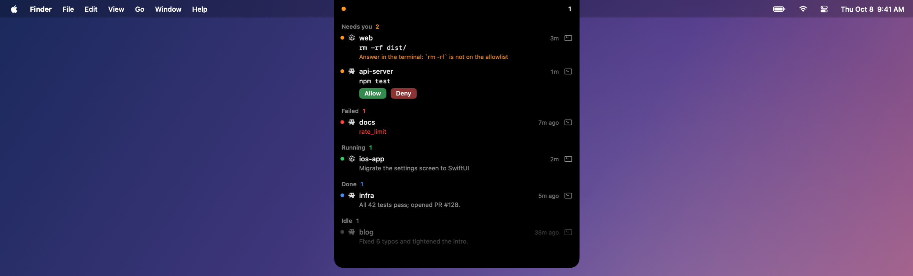
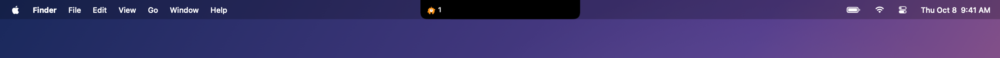
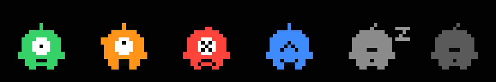
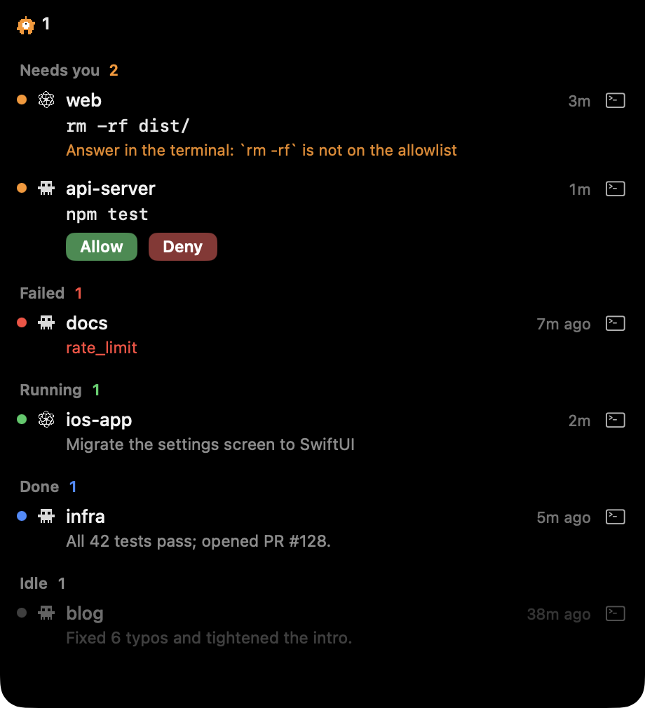

# Perch

**Your AI coding agents, live in the MacBook notch.** See at a glance which session is running, which one needs you, and which one finished or failed. Approve safe commands right there, or click to jump back to the right terminal.

<p align="center"></p>

The loop it is built for: **an agent is waiting for you → the notch lights up → you handle it in place, or jump back.**

- **One row per agent session**, in five states: 🟠 Needs you · 🔴 Failed · 🟢 Running · 🔵 Done · ⚪ Idle.
- **A pixel cyclops lives in the notch** and acts out the most urgent state: it trots while an agent runs, waves at you when one needs you, and hops when one starts needing you, fails or finishes.
- **Allow / Deny in the notch** for commands on your allowlist (`npm test`, `git status`, …). Everything else shows the full command and *Answer in the terminal*.
- **Click a row** to go back to its terminal (the exact Ghostty tab) or its desktop app.
- Works with **Claude Code** and **Codex**, in the terminal or their desktop apps, through their hooks. No changes to how you run them.

macOS 14+, any Mac. On displays without a notch it sits in a small capsule at the top of the screen.

## Install

Needs a Swift 5.9+ toolchain: Xcode or just the Command Line Tools (`xcode-select --install`).

```bash
git clone https://github.com/cryptowizard0/perch.git && cd perch
scripts/install.sh
```

This builds everything and installs:

- `perch` and `perchd` into `~/.local/bin` (`PREFIX=…` to change; put it on your `PATH` to use `perch` yourself), and `perchd` as a launchd agent;
- `Perch.app` into `~/Applications` (`APPDIR=…`), which it then opens;
- the hooks for Claude Code (`~/.claude/settings.json`) and, if you use Codex, for Codex (`~/.codex/hooks.json`). `--no-hooks` skips them.

Re-run `scripts/install.sh` after pulling to upgrade.

<details>
<summary>Uninstall</summary>

```bash
osascript -e 'quit app id "dev.perch.app"'
perch hooks uninstall claude-code
perch hooks uninstall codex
perchd uninstall
rm ~/.local/bin/perch ~/.local/bin/perchd
rm -rf ~/Applications/Perch.app ~/.perch     # ~/.perch holds the database and settings
```
</details>

### Codex: trust the hooks

**Codex skips new hooks silently until you trust them**, so until you do, Codex sessions never show up in the notch. After installing, start `codex`, type `/hooks` and trust Perch's six hooks (UserPromptSubmit, PermissionRequest, PostToolUse, Stop, Interrupt, SessionEnd), then open a new Codex session.

Codex remembers trust per hook content, so do it again whenever the hooks change: after `perch hooks install codex` with a different `perch` path or `--wait`, or after moving `perch`. Claude Code needs no such step.

### Prebuilt (Apple silicon)

Each [release](https://github.com/cryptowizard0/perch/releases) has `perch-<version>-macos-arm64.zip` with `perch`, `perchd` and `Perch.app`. It is ad-hoc signed, not notarized. In the folder you unzipped it to:

```bash
xattr -dr com.apple.quarantine perch-*-macos-arm64
mkdir -p ~/.local/bin ~/Applications
cp perch-*-macos-arm64/perch perch-*-macos-arm64/perchd ~/.local/bin/
ditto perch-*-macos-arm64/Perch.app ~/Applications/Perch.app
~/.local/bin/perchd install
~/.local/bin/perch hooks install claude-code
~/.local/bin/perch hooks install codex
open ~/Applications/Perch.app
```

Then trust the hooks in Codex (above).

- **Clear the quarantine flag first.** Otherwise macOS blocks `perch` when an agent runs it in the background, without telling anyone.
- **Copy the binaries to where they will stay, then install from there.** The hooks and the launchd agent remember the absolute path of the `perch` / `perchd` that installed them; running them from the unzipped folder breaks everything once that folder is gone.

## Use

| | |
| --- | --- |
| Hover the notch | Expand the panel |
| Click a row | Jump to that session's terminal or app; a Done session turns Idle |
| **Allow** / **Deny**, or ⌥⇧A / ⌥⇧D | Answer the first request in the panel |
| ⌥⇧O | Jump to the session that has waited longest |
| Right-click a row | *Remove from Panel* (its next event brings it back) |

The shortcuts exist only while there is something to answer or jump to, so the rest of the time those keys type as usual.

```bash
perch session ls                       # what the panel shows, in the terminal
perch allowlist                        # what may be approved from the notch
perch allowlist check Bash "npm test"  # would this be?
perch allowlist init                   # write ~/.perch/allowlist.json to edit
```

## Safety

- **Perch never allows anything by default.** If you don't answer in the notch within 20 seconds, the agent's own prompt appears in the terminal as usual.
- Only commands on the allowlist get buttons. The default is strict: read-only tools (Read, Glob, Grep, WebFetch, WebSearch) and a few Bash commands (`npm test`, `pytest`, `cargo test`, `git status` / `diff` / `log`). Any shell operator (`;`, `|`, `>`, `$(…)`, …), `rm`, `sudo`, and writes to `.env`, `~/.ssh` or `*.pem` always go to the terminal. A broken allowlist file approves nothing.
- The panel always shows the full command, never a summary.

## Troubleshooting

| Symptom | Check |
| --- | --- |
| Codex sessions never appear | The hooks are not trusted yet: `/hooks` in `codex` (see [Codex: trust the hooks](#codex-trust-the-hooks)). `grep -A1 'hooks.json:permission_request' ~/.codex/config.toml` shows a `trusted_hash` once they are. |
| Claude Code sessions never appear | Claude Code needs no trust step and picks up new hooks on its own. Type `/hooks` in `claude`: Perch's eight hooks should be listed under user settings. If not, check for `"disableAllHooks": true` in any settings file (a project's settings override yours), `allowManagedHooksOnly` in managed settings on a work machine, and that `CLAUDE_CONFIG_DIR` was the same when you ran `perch hooks install claude-code`. |
| No session appears for any agent | `perch session ls` must list sessions; if it cannot connect, `perchd` is not running (`perchd install` again). Prebuilt: is the quarantine flag cleared (`xattr -l ~/.local/bin/perch`) and do the hooks point at a `perch` that still exists (`grep perch ~/.codex/hooks.json ~/.claude/settings.json`)? |
| A hook fails | Hooks never print anything or block the agent; failures go to `~/.perch/hook.log`. No such file usually means the hook was never run at all. |

## How it works

```
Claude Code / Codex ──hook──▶ perch hook ──▶ perchd ──events──▶ Perch.app (notch)
                                             SQLite, ~/.perch/perchd.sock
```

- `perch` is the CLI and the hook adapter. It reports each hook event (prompt, needs you, done, failed, …) as a session update.
- `perchd` is the daemon and the only thing that touches the database. It runs the session state machine and pushes changes to the app, never polled: CLI to notch averages about 15 ms (budget 200 ms).
- `Perch.app` is the notch panel (AppKit + SwiftUI).

`perch watch --json` streams the same events, one JSON object per line. Every command takes `--json`; `perch --help` lists them all (the todo commands `add` / `ls` / `done` are still there, though the notch shows only agent sessions for now).

## Develop

No Xcode project: everything is SwiftPM.

```bash
swift build && swift test                              # CLI, daemon, libraries, tests
scripts/bundle-app.sh && open .build/Perch.app          # the notch app (CONFIG=debug for a debug build)
PERCH_HOME=/tmp/perch-dev swift run perchd --no-http    # a daemon with its own data, away from ~/.perch
scripts/measure-latency.sh                              # CLI → notch latency
```

Design notes (in Chinese): [docs/PRD.md](docs/PRD.md) (product), [docs/MILESTONES.md](docs/MILESTONES.md), [project.md](project.md) (status and handover), [CLAUDE.md](CLAUDE.md) (architecture rules).

## Screenshots

Collapsed, the notch shows the mascot acting out the most urgent session's state, and how many sessions are running:

<p align="center"></p>

<p align="center"></p>

Running trots and looks around, Needs you waves and flashes its antenna, Failed and Done stand still, Idle sleeps. It moves only when it has something to say, and stays still with Reduce Motion on.

Expanded on hover, sessions are grouped by state, most urgent first:

<p align="center"></p>

Each row shows the agent (Claude Code's pixel monster, Codex's knot), the project, how long it has been in that state, and a second line: the prompt while running, the full command when it needs you, the error when it failed, the last reply when done.

## License

[MIT](LICENSE)
