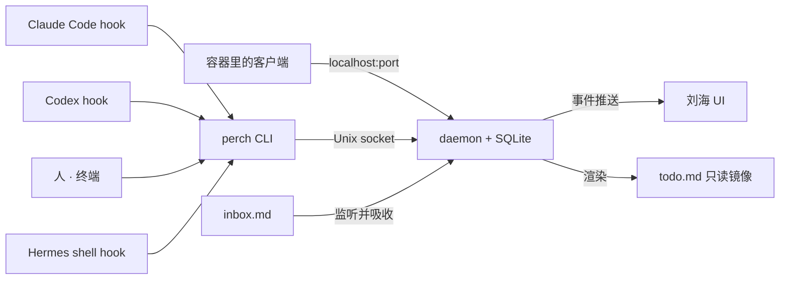

# Perch · PRD v0.2

2026-09-24 · Webber（v0.1）· 2026-09-28 方向调整为 agent 面板（v0.2）

## v0.2 方向调整（2026-09-28）

v0.1 的定位是"agent 等待队列 + 我的待办"。M1–M6 做完后调整为：**刘海是 agent 的灵动岛面板**，只显示 agent 会话的状态。

- **todo 暂时搁置**：刘海 UI 里拿掉 task、快速录入、到期提醒；daemon、SQLite、`perch add/ls/done`、`todo.md` / `inbox.md` 全部保留不动（CLI 契约不变）。以后作为展开态里一个**独立的 tab** 回来，不和 agent 面板混在一起。
- **一行 = 一个 agent 会话**（按 `session_id`），从第一次发 prompt 到 SessionEnd，状态在五种之间流转（见下方"Agent 面板"）。
- **先接 Claude Code 和 Codex**；Hermes 的会话生命周期不同（每轮都发 `on_session_end`、gateway 会话没有"关闭"、进程常驻），暂不显示，单独一个里程碑迁移。
- 本文下方凡是和"Agent 面板"一节冲突的 v0.1 描述（收起态数字 = 待办数、notice、快速录入等），以"Agent 面板"为准。

## 定位与原则

**Agent 的灵动岛**：住在 MacBook 刘海里的 agent 状态面板。一眼看到每个 agent 会话在跑、在等你、跑完了还是出错了。核心闭环：agent 在等你 → 刘海亮 → 你就地处理或跳回去。

iPhone 灵动岛的三个原语直接映射到 agent：

| 灵动岛原语 | 在本产品中的对象 | 刘海上的表现 |
| --- | --- | --- |
| Live Activity（正在进行的事） | 每个 agent 会话及其状态 | 收起态：总状态色点 + 运行中会话数；展开态：按状态分组的会话列表 |
| Alert（需要你处理） | agent 等权限、等回答、出错 | 橙 / 红色脉冲，展开后排在最前 |
| Control（就地操作） | 批准 / 拒绝权限请求、跳回终端 | 展开态的内联按钮和全局快捷键 |

音乐控制、系统 HUD、文件中转全部不做，这是和现有刘海应用的切割线。

四条设计原则：

1. **Agent-first**：刘海上只有 agent；人手写的待办以后放在独立 tab，不影响收起态的颜色和数字。
2. **Local-first**：单机、单用户、无云端，daemon 和数据都在本地。
3. **CLI 是唯一契约**：任何能跑 shell 的 agent 零学习成本接入，存储是实现细节。
4. **第一版砍掉一切非核心**：先自用跑通，但 CLI 契约、数据模型、hook 适配器按可开源分发的形态设计。

## 背景：为什么是这个位置

刘海应用已是一个小品类，2026 年至少有 13 家在做，几乎全部围绕音乐控制、系统 HUD、文件中转；待办只有 NotchDo、NotchOwl 两家专门做，且都是人手写的个人 todo。没有一家把刘海当作人和 AI agent 之间的界面。

刘海是屏幕上唯一永远可见、不占空间的位置。同时开着多个终端跑 Codex、Claude Code、Hermes 时，它们的状态散在各自的窗口里，"哪个 agent 在等我"这个问题目前没有任何地方能一眼看到。

两个早期信号说明有人在往这边摸，但都还是附加功能而非主线：[MacNotch](https://macnotch.io/) 加了一个"AI coding agent 监控"模块，只读；[h4ckm1n-dev/atoll](https://github.com/h4ckm1n-dev/atoll) 把 Atoll fork 成"AI coding agent 的原生伴侣"，做了内联 diff 和 plan mode 展示。

技术上的窗口期也到了：Claude Code 和 Codex 都已提供阻塞式的 `PermissionRequest` hook，外部程序可以在权限提示弹出前替用户做决定。这让"在刘海里批准"从设想变成了一个脚本的事。

## 核心场景

三个场景覆盖 v0.1 的全部功能，前两个是主线。

**场景一：agent 请求权限**。Claude Code 在第二个终端里要执行 `npm test`，`PermissionRequest` hook 触发，刘海变橙色并脉冲一次。悬停展开，看到"claude-code · 等待权限：npm test · 12 秒前"和完整命令原文。命令在白名单内，点 Allow 或按 ⌥⇧A，hook 返回 allow，终端里不弹提示，agent 继续跑。如果命令是 `rm -rf build/`，刘海只显示"去终端"，点一下跳回那个 session。

**场景二：agent 跑完了**。Codex 结束一轮，`Stop` hook 触发，刘海显示一条 notice"codex · 完成：PR #42 已推送"。看一眼后它到时自动消失；想跟进就点一下转成 task。收起态的 Live Activity 从"2 agents · 4m"变成"1 agent · 1m"。

**场景三：手写待办**。按全局快捷键，输入"回复 X 的邮件 @15:00"，回车。刘海数字加一。到 15:00 系统通知弹出，刘海脉冲，过时后颜色点变红。点标题完成。

## 范围

v0.1 只做一个闭环：agent 在等你 → 刘海亮 → 就地处理或跳回去。

**做**

- todo 底座：daemon + SQLite + CLI
- 刘海 UI：收起态、展开态、快速录入、实时更新
- Claude Code 和 Codex 的 hook 适配器（同一套脚本）
- Hermes 的接入（M6 定：Hermes 跑在本机，走 shell hook，同一个适配器；HTTP 端口留给容器里的客户端）
- 三个控制动词：approve、deny、open
- 刘海批准的安全白名单
- 时间提醒：系统通知 + 刘海脉冲

**不做，及原因**

| 不做 | 原因 |
| --- | --- |
| dispatch（从刘海往 agent 派任务） | 把产品从"响应 agent"变成"指挥 agent"，是第二条产品线，先把响应侧做扎实 |
| stop / cancel | Claude Code 和 Codex 没有干净的外部停止接口，只有 Hermes 能做，不值得为一个 agent 加动词 |
| reply（在刘海里回答 agent 的提问） | agent 提问走 `Notification` hook 的 `elicitation_dialog`，不阻塞，刘海接不到回答的口子；等官方给阻塞式提问 hook 再加 |
| MCP server | 三个目标 agent 都能跑 shell 或 HTTP，暂时没有需要 MCP 的场景 |
| markdown 双向同步 | daemon 持有 SQLite 时，手改文件再同步是冲突和重复 id 的集中产地；改为只读镜像 + 追加式收件箱 |
| 音乐控制、系统 HUD、文件中转 | 现有 13 家都在做，不是本产品的差异化 |
| 项目、标签、子任务、重复任务 | todo 只是底座，不追求完整的任务管理 |
| 云同步、iPhone、日历、多用户 | local-first，单机单用户 |
| Windows / Linux | 刘海是 Mac 硬件特性 |

无刘海的 Mac 上退化为顶部居中的小胶囊，成本很低，保留。

## 数据模型

一张表，控制请求完全复用待办的管道，不另开一套。

| 字段 | 类型 | 说明 |
| --- | --- | --- |
| id | string | 短、可手打，如 `t7k2` |
| title | string | 标题 |
| kind | enum | `task` 需要我行动 / `notice` 仅告知、到时自动消失 / `request` agent 在等一个决定 |
| status | enum | `open` / `waiting`（agent 在等我）/ `done` / `dismissed` |
| source | string | `human` / `claude-code` / `codex` / `hermes`；自由字符串，新 agent 不用改代码 |
| due_at | datetime? | 到期时间，触发提醒 |
| link | string? | URL、文件路径或终端 session 引用，点一下跳回去 |
| meta | json? | agent 自由塞 cwd、session_id、工具名等 |
| created_at / updated_at | datetime | — |

`request` 类型多三个字段：

| 字段 | 类型 | 说明 |
| --- | --- | --- |
| options | string[] | 如 `["allow","deny"]` |
| response | string? | 用户选的值，hook 脚本等的就是它 |
| expires_at | datetime | 超时后 hook 不返回决定，终端原生提示接管 |

`kind` 里区分 task 和 notice 是因为"agent 完成了"不是待办，混在一个列表里会稀释橙色信号的含义。

**v0.2 新增 `sessions` 表**（M7，schema v2）。会话状态只放这里，不再用 item 表达：Claude Code / Codex 的 hook 不再产生 waiting / notice，item 表里只剩刘海可以回应的 request（hook 用 `--wait` 等它的回应值），request 通过 `meta.session_id` 挂到会话那一行。

| 字段 | 说明 |
| --- | --- |
| id | agent 自己的 `session_id` |
| source | `claude-code` / `codex` / …，决定像素图标 |
| title / cwd | 项目名（cwd 的目录名）和目录 |
| link | 跳回终端（`perch-terminal://…`） |
| status | `waiting`（Needs you）/ `failed` / `running` / `done` / `idle` |
| prompt | 本轮 prompt 的首行（运行中显示） |
| last_message | 最后一条回复的首行（完成 / 空闲显示） |
| detail | 等你时的详情：完整命令原文、原因、"去哪里回答" |
| error | 出错时的错误类型 |
| pid / pid_started_at | agent 进程和它的启动时间，用于存活检测（防 pid 复用） |
| started_at / turn_started_at / status_at / updated_at | 首次出现、本轮开始、进入当前状态、最后一次事件 |

清理：perchd 每 30 秒检查 pid，进程没了就移除；拿不到 pid 的会话 24 小时没有事件就移除；`perch session rm <id>` 和刘海右键可以手动移除（之后再来事件会重新出现）。

## 接口层

CLI 是唯一契约，daemon 是唯一真相，刘海 UI、CLI、Hermes 全是 daemon 的客户端。



所有写入汇到 daemon，所有读取从 daemon 推出，没有任何客户端直接碰 SQLite。

**CLI `perch`**

| 命令 | 作用 |
| --- | --- |
| `add "<title>" [--kind task\|notice\|request] [--source <s>] [--status waiting] [--due @15:00\|+30m] [--link <ref>] [--key <k>] [--wait]` | 新建；`--key` 幂等，同一 key 重复 add 不产生重复项；`--wait` 阻塞到 request 被回应或超时 |
| `ls [--status] [--source] [--json]` | 列出 |
| `done <id>` | 完成 |
| `respond <id> <value>` | 回应 request |
| `rm <id>` | 删除 |
| `watch [--json]` | 流式输出事件，用于调试和第三方订阅 |
| `hooks install claude-code\|codex` | 一行安装 hook 适配器 |

全部命令支持 `--json`。配一份 5 行的 SKILL.md 片段（`docs/AGENT-SNIPPET.md`），塞进 AGENTS.md / CLAUDE.md 即可让 agent 主动使用。

**daemon**：launchd 常驻，SQLite 存储，暴露 Unix socket（本机 CLI 和 UI）和一个 localhost 端口（Hermes 容器通过 `host.docker.internal:port` 访问，和现有 webhook 架构一致）。事件通过 socket 广播推送，不轮询。

**文件**：`todo.md` 是 daemon 渲染的只读镜像，agent 可以 `cat`，也能进 git 或 Obsidian；`inbox.md` 是追加式收件箱，任何人往里写一行 `- [ ] xxx`，daemon 监听到就吸收进库并清空。两个文件都是单向的，没有双向同步。

## Hook 适配

四个事件，Claude Code 和 Codex 共用一套脚本，两家的 stdin JSON 结构、返回格式和默认 600 秒超时都一致（M5 核对：Codex 没有 `Notification`，多一个 `Interrupt`；实现以 CLAUDE.md 的"Hook 适配"为准）。

| 事件 | 触发时机 | 适配器做什么 | 是否阻塞 agent |
| --- | --- | --- | --- |
| `UserPromptSubmit` / `Stop` | 一轮开始、一轮结束 | 维护 Live Activity：哪些 agent 在跑、这一轮跑了多久（M3 定：按轮计时，不按会话） | 否 |
| `Notification`（matcher: `permission_prompt`、`elicitation_dialog`、`agent_needs_input`；M3 定：不接 `idle_prompt`，否则每轮结束都变橙） | agent 需要人 | `perch add --status waiting --key <session_id>`，刘海变橙 | 否 |
| `Stop` | 一轮结束 | resolve 同一 key 的 waiting，发一条 notice（带 `last_assistant_message` 摘要） | 否 |
| `PermissionRequest` | 权限提示弹出前 | `perch add --kind request --wait`，阻塞等刘海响应；拿到 allow/deny 后按各家格式打印 JSON 退出 | 是 |

`PermissionRequest` 的返回格式两家相同（M4 / M5 按官方文档核对）：`{"hookSpecificOutput":{"hookEventName":"PermissionRequest","decision":{"behavior":"allow"|"deny","message":"…"}}}`。

刘海只是快捷通道，不是唯一通道：适配器等刘海的时间设为 15–30 秒，超时就不返回决定，终端的原生提示照常弹出。在终端前的人最多多等几十秒，不会被卡死。

**v0.2（M7）**：Claude Code / Codex 的事件改为驱动会话状态（见"Agent 面板"的状态表），不再产生 waiting / notice item；只有白名单内的 PermissionRequest 仍然发 request 等刘海。每个事件都带上 agent 进程的 pid（`perch hook` 沿父进程链找），供 perchd 做存活检测。Hermes 的映射 M9 再改。

安装：`perch hooks install claude-code` 写 `~/.claude/settings.json`，`perch hooks install codex` 写 `~/.codex/hooks.json`。Codex 的 hook 要在 codex 里用 `/hooks` 确认信任后才会跑。

~~Hermes 不走 hook，直接调 daemon 的 HTTP 接口~~。M6 改：Hermes 实际跑在本机（不在 Docker 里），有自己的 shell hook（`pre_llm_call` / `post_llm_call` / `pre_approval_request` 等），所以和 Claude Code、Codex 一样走 `perch hook hermes`。Hermes 的审批 hook 只能观察，刘海只能提示去哪里回答，不能批准。HTTP 接口保留，给够不着 Unix socket 的容器客户端。

Sources：[Claude Code hooks reference](https://code.claude.com/docs/en/hooks) · [Codex hooks](https://learn.chatgpt.com/docs/hooks)

## 安全规则

在几百像素的刘海里批准 `rm -rf` 是危险的，这是"控制台"和"看板"的根本区别。三条硬规则：

1. **展开态必须显示完整命令原文**，不截断、不摘要。命令过长时刘海展开区域可滚动，但不提供折叠。
2. **刘海是快捷通道，不是唯一通道**。hook 等刘海响应 15–30 秒，超时不返回决定，终端原生提示接管。任何情况下都不会因为刘海而默认放行。
3. **白名单之外不给批准按钮**。只显示"去终端"，点一下跳回去处理。

默认白名单按工具名和命令模式匹配，用户可改：

| 分类 | 刘海可一键放行 | 只能去终端 |
| --- | --- | --- |
| 文件 | Read、Glob、Grep | Write、Edit 到 `.env`、`~/.ssh`、`*.pem` |
| Bash | `npm test`、`pytest`、`cargo test`、`git status/diff/log` | `rm`、`sudo`、`git push --force`、`curl \| sh`、任何带 `>` 重定向到仓库外的命令 |
| 网络 | WebFetch、WebSearch | — |
| 其他 | — | 白名单未覆盖的一律去终端 |

白名单是一个本地配置文件，后续会是产品的一部分：每个团队对"什么可以盲批"的定义不同。

## Agent 面板（v0.2，M7 / M8）

### 会话与状态

一行 = 一个 agent 会话（按 `session_id`）。第一次发 prompt 时出现（不装 SessionStart，开了窗口没干活的会话不占位置），SessionEnd 或进程消失时移除。任何 hook 事件都能创建或更新会话。

| 状态（UI 文案） | 进入 | 离开 | 圆点 |
| --- | --- | --- | --- |
| **Needs you** | PermissionRequest / Notification（权限、提问） | PostToolUse(Failure)、刘海 Allow / Deny、UserPromptSubmit、Stop / StopFailure | 🟠 橙，进入时脉冲 |
| **Failed** | StopFailure（API 报错、限流等） | 下一次 UserPromptSubmit | 🔴 红，进入时脉冲 |
| **Running** | UserPromptSubmit；等你之后工具跑了 | Stop / StopFailure / 等你 | 🟢 绿，呼吸动画 |
| **Done** | Stop | 10 分钟后，或从刘海跳回那个终端 → Idle；下一次 UserPromptSubmit → Running | 🔵 蓝，静止，进入时脉冲一次 |
| **Idle** | Done 过期或已看过；Codex 的 Interrupt（Esc） | 下一次 UserPromptSubmit | ⚪ 灰 |

"等审批"和"等回答"合成一种 Needs you，行内文字区分。优先级：**Needs you > Failed > Running > Done > Idle**。

### 收起态

- **一个总色点**：取所有会话里优先级最高的状态；没有会话是灰点；perchd 离线是离线图标。
- **运行中会话数**：只数 Running，为 0 时不显示。
- 不再显示耗时（"· 4m"挪进展开态每一行）。

### 展开态（悬停触发）

按状态分组，组标题带数量（`Needs you 1` / `Failed 1` / `Running 3` / `Done 2` / `Idle 1`），空组不显示。组内排序：Needs you 等得最久的在前；Running 按本轮开始时间；Done / Idle 最近的在前。展开态的结构要能在以后加 tab（todo 回来时用），这一版不画 tab 栏。

每行两行字：

```
● [像素图标]  perch                              4m   ⤴
             Refactor the session state machine…
```

| 状态 | 第二行 | 时间 |
| --- | --- | --- |
| Needs you（审批） | 完整命令原文 + Allow / Deny（白名单内）或 "Answer in the terminal: 原因"（白名单外、超时；安全规则不变） | 等了多久 |
| Needs you（提问） | agent 的原话（Notification 的 message），没有就 "Waiting for your answer" | 等了多久 |
| Failed | 错误类型 | 多久前 |
| Running | 本轮 prompt 的首行 | 本轮已跑多久 |
| Done | 最后一条回复的首行 | 多久前完成 |
| Idle | 同 Done，整行变暗 | 多久前 |

**agent 图标**：自己渲染的 12×12 像素点阵（代码里的字符串，SwiftUI `Canvas` 逐格画，不抗锯齿），单色白，Idle 时随整行变暗。颜色只给状态圆点。只取意象，不照描任何 logo，不打包任何商标文件：Claude Code = 像素小怪物，Codex = `>_`，Hermes = 翅膀，未知 agent = 小机器人。新 agent 加一张点阵即可。

文案一律英文。

### 交互

| 操作 | 效果 |
| --- | --- |
| 点整行（Allow / Deny 按钮除外） | 跳回那个会话的终端（Ghostty 定位到 tab，其他终端激活 App）；Done 顺带变 Idle |
| Allow / Deny | 只在白名单内的审批上出现 |
| ⌥⇧A / ⌥⇧D | 批准 / 拒绝面板上第一个 Allow / Deny（排序最前、带 request 的 Needs you 会话）；没有就不注册，键照常打字 |
| ⌥⇧O | 跳到等得最久的 Needs you 会话；没有就不注册 |
| 右键某一行 | "Remove from Panel"：手动移除（进程检测失效时的逃生口） |
| 右键刘海 | Quit Perch |

todo 相关交互（点标题完成、⌥ 点推迟、notice 转 task、⌥⇧Space 快速录入、到期提醒）随 todo 一起从 UI 下线。

### 提醒

只靠刘海脉冲（见状态表）。不发系统通知，不加提示音。全屏 App 下刘海可能不可见，M8 核实。

**实时性指标**：CLI / hook 调用到刘海更新 ≤ 200 ms，靠 daemon 推事件，不轮询。

## 技术路线

Swift 全栈，一种语言：SwiftUI 做刘海 UI，daemon 和 CLI 用 Swift ArgumentParser 打成单二进制，SQLite 直接用系统 libsqlite3（M1 定，不用 GRDB）。

刘海窗口那套 NSPanel 技巧不自己写：[NotchDo](https://notchdo.app/) 是 MIT 协议，又正好是"刘海里的待办"，拿它的窗口层，换掉数据层。[Boring Notch](https://github.com/TheBoredTeam/boring.notch) 是 GPL-3.0，借它的代码会把整个项目锁成 GPL，产品化时是麻烦，不用。[luifon/notch-widget](https://github.com/luifon/notch-widget) 的 `CGSSpace.swift` 是 MPL-2.0，可以单文件引用。

系统要求 macOS 14+，与三家主流刘海应用一致。

## 构建顺序

v0.1 六个里程碑 + v0.2 三个，每一步都能独立验证再往下走；第三步完成时产品已经能日常使用。详见 `MILESTONES.md`。

| # | 里程碑 | 验证方式 |
| --- | --- | --- |
| 1 | daemon + CLI + SQLite + `watch`，不带 UI | 两个终端互相 `add` 和 `watch`，确认事件延迟和 `--key` 幂等 |
| 2 | 刘海 UI，借 NotchDo 窗口层 | 收起 / 展开 / 快速录入 / 点完成，CLI 到 UI ≤ 200 ms |
| 3 | Claude Code 的 `Notification` / `Stop` / `SessionStart` 适配 | 跑一个需要权限的任务，刘海变橙；跑完后 notice 出现并自动消失 |
| 4 | `PermissionRequest` + 白名单 | 刘海里 Allow 一次 `npm test`，终端不弹提示；`rm` 只显示"去终端"；超时后终端提示正常弹出 |
| 5 | Codex 复用同一套脚本 | 同步骤 3、4，只改返回 JSON 的分支 |
| 6 | Hermes 接入（M6 改为 shell hook） | Hermes 一轮 → Live Activity + notice；危险命令等审批时刘海变橙，回应后消失 |
| 7 | 会话状态机：`sessions` 表、pid 存活检测、Claude Code / Codex 的 hook 映射重写（不动 UI） | 真实 Claude Code 和 Codex 会话，`perch session ls` 状态流转正确；关掉终端 tab 30 秒内消失 |
| 8 | Agent 面板 UI；刘海上的 todo UI 下线 | 真实会话下颜色、数量、分组、跳转、审批都正确；CLI 到刘海 ≤ 200 ms |
| 9 | Hermes 迁到会话模型（单独设计） | 待定 |

`todo.md` 镜像和 `inbox.md` 收件箱放在第 1 步和第 2 步之间，工作量小，不单列。

## 未决问题与产品化余地

- [x] `link` 跳回终端的机制：日常用 Ghostty。Ghostty ≥ 1.3 可 AppleScript：提交 prompt 时记下聚焦的 terminal id，跳转时 focus 它；其他终端只激活 App。
- [x] 产品名 Perch（栖），CLI `perch`：agent 停在刘海上等你。
- [x] 全局快捷键默认值：快速录入 ⌥⇧Space。
- [x] hook 等刘海的超时：先用 20 秒（可改），用一周后再看。

产品化余地：这个品类里 13 家全在做音乐控制，"agent 的灵动岛"的位置是空的。护城河不在 UI，在 hook 适配器目录和安全白名单——每多支持一个 agent 就是一个适配器，开源 CLI 加适配器目录天然是面向 Claude Code / Codex 用户的分发方式。自用跑通前不展开。
